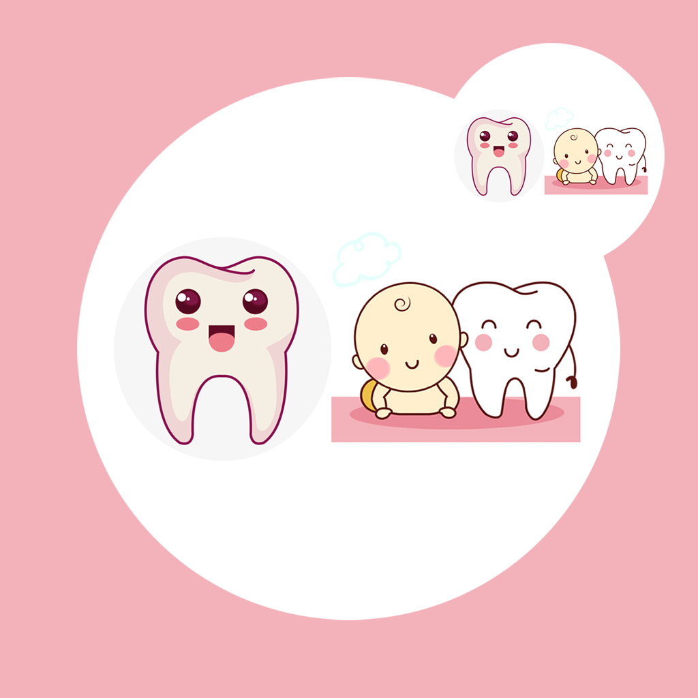

## 欢迎来到 宝宝乳牙脱落记录工具

不知道你是否也注意到自己家宝宝乳牙的脱落情况？宝宝从出生到快速健康成长的过程中，乳牙也在不断发生变化，而我们作为宝宝最亲近的父母，是不是也很关心宝宝的牙齿健康状况？当宝宝乳牙出现脱落时，我们应该密切关注宝宝的牙龈状况，是否哭闹不肯进食。我们可以将宝宝的这些重要信息记录起来，帮助宝宝牙齿将康。我们可以记录宝宝牙齿脱落的位置，例如门牙，牙槽等。脱落的时间，乳牙脱落的数量等。我们可以将这些信息收藏起来，整理成记录列表，帮助宝宝分析和养成良好的习惯，保护牙齿健康，防止乳牙异常脱落的情况发生。

如果您遇到什么需要解答的问题，请发送您的问题到以下邮箱。

我们将第一时间为您解答。

### 邮箱地址:  jichungan9498@163.com

谢谢！
